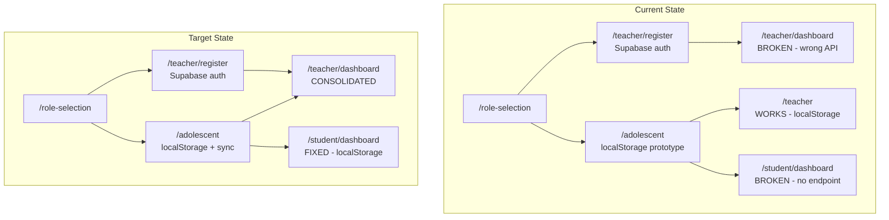

# SelfReg AI — Development Plan

## Executive Summary

The audit reveals a project with **two parallel, incompatible architectures**:

- **Path A (working)**: localStorage-based prototype at `/adolescent` and `/teacher` — fully functional 5-stage self-regulation cycle with A/B scenario detection, session persistence, and teacher analytics
- **Path B (broken/stub)**: Supabase-backed pages at `/teacher/dashboard`, `/teacher/dashboard/child`, `/student/dashboard` — disconnected from the main flow, with non-existent API endpoints and stub content

The core domain model (self-regulation engine, scenario detection, state machine) is **complete and working**. The UI layer has a **split identity** — two different styling approaches, two different data flows, and no coherent navigation.

---

## Architecture Overview

---

## Phase 1: Fix Broken Pages (Critical)

### 1.1 Fix Student Dashboard (`/student/dashboard`)

**Problem**: Calls `/api/children?childId=current` which doesn't exist. The API route only handles `childId` (specific UUID) or `teacherId` queries.

**Solution**: Refactor to read from `localStorage` via `ChildrenStorage` + `SessionManager`, matching the pattern used by the working `TeacherDashboard`. The student dashboard should:
- Read child profile from `localStorage` (using `childId` from URL params or sessionStorage)
- Read completed sessions from `localStorage`
- Fall back to server API if Supabase is enabled and child has a `teacherId`

**Files to modify**:
- `app/student/dashboard/page.tsx` — Replace API call with localStorage read + optional server sync

### 1.2 Fix Teacher Dashboard Page (`/teacher/dashboard`)

**Problem**: Uses a different `Child` interface (no `sessions` array, just `totalSessions: number`), calls `/api/children?teacherId=...` expecting `{ ok, children }` format, and imports `ClassStats`/`ProgressChart` components that may not match the data model.

**Solution**: Either:
- **(Recommended) Remove** this page and redirect to `/teacher` (the working `TeacherDashboard`), OR
- Integrate it with the working `TeacherDashboard` by sharing the same data-fetching logic

**Files to modify**:
- `app/teacher/dashboard/page.tsx` — Either remove or refactor to use `ChildrenStorage`
- `app/teacher/dashboard/child/page.tsx` — Either remove or refactor to show real session data

### 1.3 Fix Child Detail Page (`/teacher/dashboard/child`)

**Problem**: Shows only basic info + "Раздел в разработке" section. No session history, no analytics.

**Solution**: Either remove (if parent dashboard is removed) or refactor to show real session data from localStorage.

---

## Phase 2: Navigation & Auth (High Priority)

### 2.1 Add Middleware for Route Protection

**Problem**: No route protection exists. Any user can access any page.

**Solution**: Create `middleware.ts` that:
- Checks `sessionStorage`/cookies for role and auth state
- Redirects unauthenticated users to `/role-selection`
- Redirects teachers to `/teacher` and students to `/adolescent` based on role
- Preserves `lang` query parameter across redirects

**Files to create**:
- `middleware.ts` — Next.js middleware for route protection

### 2.2 Fix Role Selection Flow

**Problem**: Role selection routes teacher → `/teacher/register` (Supabase auth) and student → `/adolescent` (localStorage prototype). No persistence of role selection beyond `sessionStorage`.

**Solution**: 
- Add role persistence (localStorage or cookie)
- After teacher registration, route to `/teacher` (working dashboard) instead of `/teacher/register-success`
- After student role selection, route to `/adolescent` with proper params

**Files to modify**:
- `app/role-selection/page.tsx` — Add role persistence, fix routing

### 2.3 Consolidate Teacher Dashboard

**Problem**: Two dashboards exist — `/teacher` (working, localStorage) and `/teacher/dashboard` (broken, Supabase).

**Solution**: 
- Make `/teacher` the canonical teacher dashboard
- Add a redirect from `/teacher/dashboard` to `/teacher`
- The working `TeacherDashboard` already has server-backed mode (when `teacher` param is present) — enhance this path

**Files to modify**:
- `app/teacher/dashboard/page.tsx` — Add redirect to `/teacher`
- `app/teacher/page.tsx` — Already wraps `TeacherDashboard` in `ErrorBoundary` — good

---

## Phase 3: Supabase Integration (Medium Priority)

### 3.1 Fix API Endpoint for Student Dashboard

**Problem**: `/api/children?childId=current` doesn't exist.

**Solution**: Add `current` as a special `childId` value that reads from `sessionStorage` or cookies to find the current child's ID, then delegates to `fetchChildFromSupabase`.

**Files to modify**:
- `app/api/children/route.ts` — Handle `childId=current` special case

### 3.2 Complete Supabase Sync Pipeline

**Problem**: The localStorage → Supabase sync is partially implemented (in `ChildrenStorage.attachHistoryInsight` and `saveAdolescentFeedback`) but the Supabase-backed pages don't use it.

**Solution**: 
- Ensure all writes to `ChildrenStorage` also sync to Supabase when enabled
- Add a sync status indicator to the UI
- Add a "force sync" button for teachers

**Files to modify**:
- `lib/children-storage.ts` — Enhance sync reliability
- `lib/session-manager.ts` — Add sync status tracking

### 3.3 Add Auth-Aware Data Routing

**Problem**: When Supabase auth is used (teacher registration), the data should flow through Supabase. When not, localStorage should be used.

**Solution**: Create a `DataRouter` abstraction that:
- Checks `NEXT_PUBLIC_SUPABASE_ENABLED` and auth state
- Routes reads/writes to either `ChildrenStorage` or `server-storage`
- Provides a unified API for all components

**Files to create**:
- `lib/data-router.ts` — Unified data access layer

---

## Phase 4: Code Quality (Medium Priority)

### 4.1 Remove Code Duplication

**Problem**: `isProgressRecord` and `isSessionComplete` exist in both `lib/selfreg-flow-machine.ts` and `lib/session-helpers.ts`.

**Solution**: Consolidate into `lib/selfreg-flow-machine.ts` and have `lib/session-helpers.ts` re-export from there.

**Files to modify**:
- `lib/session-helpers.ts` — Remove duplicates, re-export from flow machine

### 4.2 Set Up Testing Infrastructure

**Problem**: `__tests__/` directory exists but `package.json` has no test scripts. No Jest/Playwright config.

**Solution**: 
- Add Jest + React Testing Library
- Add Playwright for E2E
- Make existing tests runnable
- Add CI configuration

**Files to modify**:
- `package.json` — Add test scripts and dev dependencies
- `jest.config.ts` — Create Jest config
- `playwright.config.ts` — Create Playwright config

### 4.3 Add Error Boundaries

**Problem**: Only `AdolescentPrototype` and `TeacherDashboard` have `ErrorBoundary` wrappers.

**Solution**: Add error boundaries to all page-level components, especially the dashboard pages.

**Files to modify**:
- `app/student/dashboard/page.tsx` — Add ErrorBoundary
- `app/teacher/dashboard/page.tsx` — Add ErrorBoundary
- `app/teacher/dashboard/child/page.tsx` — Add ErrorBoundary
- `app/teacher/register.tsx` — Add ErrorBoundary

---

## Phase 5: UI Polish (Lower Priority)

### 5.1 Consolidate Styling

**Problem**: The working prototype uses `app/globals.css` with CSS custom properties. The broken dashboard pages use inline styles. Two different visual languages.

**Solution**: 
- Convert all inline styles in dashboard pages to use `globals.css` classes
- Ensure consistent spacing, colors, and typography
- Add dark mode support via CSS custom properties

**Files to modify**:
- `app/student/dashboard/page.tsx` — Replace inline styles with CSS classes
- `app/teacher/dashboard/page.tsx` — Replace inline styles with CSS classes
- `app/teacher/dashboard/child/page.tsx` — Replace inline styles with CSS classes
- `app/teacher/register.tsx` — Replace inline styles with CSS classes
- `app/role-selection/page.tsx` — Replace inline styles with CSS classes
- `app/globals.css` — Add new component styles

### 5.2 Add Loading States & Transitions

**Problem**: Basic loading states exist but no skeleton screens, no transitions between pages.

**Solution**: Add skeleton loading components and page transition animations.

**Files to create**:
- `app/components/Skeleton.tsx` — Reusable skeleton component

### 5.3 Mobile Responsiveness Audit

**Problem**: The CSS has mobile-first breakpoints but the dashboard pages with inline styles have no responsive behavior.

**Solution**: Audit all pages for mobile responsiveness, especially the dashboard pages.

---

## Phase 6: Documentation & Infrastructure (Lower Priority)

### 6.1 Document Architecture Decision

**Problem**: It's unclear whether this is a localStorage-first prototype or a Supabase-backed production app.

**Solution**: Create `ARCHITECTURE.md` documenting:
- The dual-storage strategy
- When to use localStorage vs Supabase
- How to add new features
- The data flow for each user role

### 6.2 Add Build/CI Pipeline

**Problem**: No CI configuration, no build scripts beyond `next build`.

**Solution**: Add GitHub Actions workflow for linting, testing, and building.

**Files to create**:
- `.github/workflows/ci.yml` — CI pipeline

---

## Implementation Order

```mermaid
flowchart LR
    subgraph "Phase 1 - Critical"
        P1_1["1.1 Fix Student Dashboard"]
        P1_2["1.2 Fix/Remove Teacher Dashboard"]
        P1_3["1.3 Fix Child Detail Page"]
    end

    subgraph "Phase 2 - High Priority"
        P2_1["2.1 Add Middleware"]
        P2_2["2.2 Fix Role Selection"]
        P2_3["2.3 Consolidate Dashboards"]
    end

    subgraph "Phase 3 - Medium Priority"
        P3_1["3.1 Fix API Endpoint"]
        P3_2["3.2 Complete Supabase Sync"]
        P3_3["3.3 Add Data Router"]
    end

    subgraph "Phase 4 - Code Quality"
        P4_1["4.1 Remove Duplication"]
        P4_2["4.2 Testing Infrastructure"]
        P4_3["4.3 Error Boundaries"]
    end

    subgraph "Phase 5 - UI Polish"
        P5_1["5.1 Consolidate Styling"]
        P5_2["5.2 Loading States"]
        P5_3["5.3 Mobile Audit"]
    end

    subgraph "Phase 6 - Infrastructure"
        P6_1["6.1 Architecture Docs"]
        P6_2["6.2 CI Pipeline"]
    end

    P1_1 --> P1_2 --> P1_3
    P1_3 --> P2_1 --> P2_2 --> P2_3
    P2_3 --> P3_1 --> P3_2 --> P3_3
    P3_3 --> P4_1 --> P4_2 --> P4_3
    P4_3 --> P5_1 --> P5_2 --> P5_3
    P5_3 --> P6_1 --> P6_2
```

---

## Key Architectural Decision

**The localStorage path is complete and working. The Supabase path is partial and broken.**

**Recommendation**: Keep localStorage as the primary storage layer and treat Supabase as an optional sync target. This means:
1. All core functionality works without Supabase
2. When Supabase is enabled, data syncs in the background
3. The working `TeacherDashboard` and `AdolescentPrototype` remain the canonical UIs
4. The broken `/teacher/dashboard` and `/student/dashboard` pages are either removed or refactored to use the same localStorage-first pattern

This approach minimizes risk (the working parts stay working) while providing a clear upgrade path to full server-side storage.