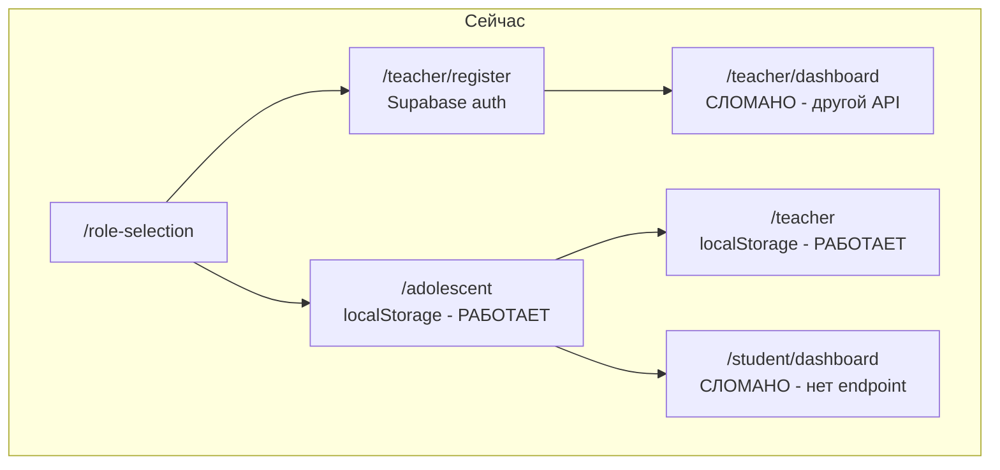
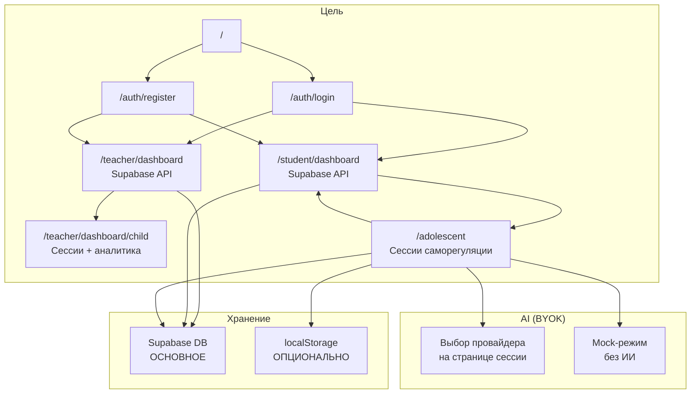
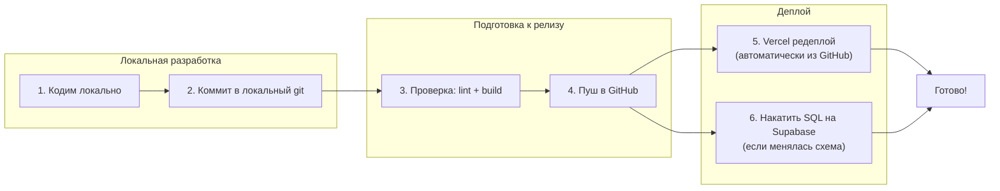
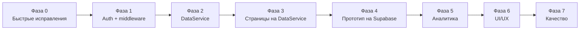

# SelfReg AI — План перехода от прототипа к версии для апробации

## Цель

Превратить текущий прототип в **работающее веб-приложение на Supabase**, готовое к апробации с реальными пользователями (подростки + учителя).

**Ключевые принципы:**
- Приложение работает **как с ИИ, так и без него** (режим Mock)
- BYOK (Bring Your Own Key) — пользователь сам подключает свой API-ключ, это наша фишка
- ИИ используется в двух местах: ответы ученику в сессии + аналитика в дашборде
- localStorage остаётся как опция для самодеплоя, **Supabase — основной сценарий**
- Всё, что работает — не ломаем. Только переводим на новое хранилище
- **⚠️ БИЛИНГВАЛЬНОСТЬ (RU/EN) — ОБЯЗАТЕЛЬНОЕ ТРЕБОВАНИЕ ДЛЯ ВСЕХ НОВЫХ СТРАНИЦ И КОМПОНЕНТОВ.** Основной язык — Русский, дополнительный — Английский. Все новые page.tsx и компоненты должны использовать `normalizeAppLang()` из `lib/app-i18n.ts`, компонент `LanguageToggle`, и полный `ui`-объект для всех текстов. Две версии (RU/EN) делаются параллельно.

---

## Текущее состояние (проблемы)

**Накопившиеся проблемы (чиним в первую очередь):**

1. **Student Dashboard** вызывает `/api/children?childId=current` — endpoint не существует → ошибка
2. **Teacher Dashboard** (`/teacher/dashboard`) — дубликат с другой моделью данных, не работает
3. **Child Detail** (`/teacher/dashboard/child`) — заглушка "Раздел в разработке"
4. **Нет middleware** — любой может зайти на любую страницу
5. **Данные в localStorage** — учитель не видит учеников с других устройств
6. **Дублирование кода** — `isProgressRecord` и `isSessionComplete` в двух файлах
7. **Нет тестовой инфраструктуры** — `__tests__/` есть, но не запускаются
8. **Inline-стили** на dashboard-страницах вместо `globals.css`

---

## Целевая архитектура

---

## План работ (8 фаз, 30 задач)

### Фаза 0: Быстрые исправления накопившихся проблем

*Приоритет: критический. Делаем первыми, чтобы приложение стало стабильным.*

| № | Задача | Описание | Файлы | Сложность |
|---|--------|----------|-------|-----------|
| 0.1 | **Починить Student Dashboard** | Переписать на чтение из localStorage через `ChildrenStorage` + `SessionManager`. Убрать вызов несуществующего endpoint | [`app/student/dashboard/page.tsx`](app/student/dashboard/page.tsx) | Средняя |
| 0.2 | **Удалить дубль Teacher Dashboard** | `/teacher/dashboard` → редирект на `/teacher`. Рабочая версия остаётся | [`app/teacher/dashboard/page.tsx`](app/teacher/dashboard/page.tsx) | Простая |
| 0.3 | **Починить Child Detail** | Показывать реальные сессии ученика из localStorage. Убрать "Раздел в разработке" | [`app/teacher/dashboard/child/page.tsx`](app/teacher/dashboard/child/page.tsx) | Средняя |
| 0.4 | **Удалить дублирование кода** | `isProgressRecord` и `isSessionComplete` — оставить в `selfreg-flow-machine.ts`, из `session-helpers.ts` убрать | [`lib/session-helpers.ts`](lib/session-helpers.ts), [`lib/selfreg-flow-machine.ts`](lib/selfreg-flow-machine.ts) | Простая |
| 0.5 | **Добавить Error Boundaries** | Обернуть все страницы в `ErrorBoundary` | Все `page.tsx` | Простая |

### Фаза 1: Аутентификация и маршрутизация

*Приоритет: высокий. Без этого нельзя выпускать в апробацию.*

| № | Задача | Описание | Файлы |
|---|--------|----------|-------|
| 1.1 | **Создать страницы входа/регистрации** | `/auth/login` и `/auth/register` через Supabase Auth. Выбор роли (учитель/ученик) при регистрации. **Билингвальные (RU/EN)** | `app/auth/login/page.tsx`, `app/auth/register/page.tsx` (создать) |
| 1.2 | **Добавить middleware** | Защита маршрутов: неавторизованных → `/auth/login`, учителей → `/teacher`, учеников → `/student/dashboard`. Сохранять `lang` | `middleware.ts` (создать) |
| 1.3 | **Переделать Role Selection** | Ведёт на `/auth/register?role=teacher` или `/auth/register?role=student`. Роль сохраняется в Supabase `user_metadata`. **Билингвальный** | [`app/role-selection/page.tsx`](app/role-selection/page.tsx) |
| 1.4 | **Доработать AuthButton** | Показывать имя пользователя, кнопку "Выйти". Уже есть — проверить и доработать. **Билингвальный** | [`app/components/AuthButton.tsx`](app/components/AuthButton.tsx) |

### Фаза 2: DataService — единый слой данных

*Приоритет: высокий. Ключевое архитектурное изменение.*

| № | Задача | Описание | Файлы |
|---|--------|----------|-------|
| 2.1 | **Создать DataService** | Единый класс для работы с данными. Выбирает источник: Supabase (если доступен + авторизован) → localStorage (fallback). Методы: `getChildren`, `getChild`, `saveSession`, `getSessions`, `deleteSession`, `saveFeedback` | `lib/data-service.ts` (создать) |
| 2.2 | **Переписать ChildrenStorage** | Делегирует в `DataService`. localStorage остаётся как fallback | [`lib/children-storage.ts`](lib/children-storage.ts) |
| 2.3 | **Переписать SessionManager** | Использует `DataService`. Сессии сохраняются в Supabase + дублируются в localStorage | [`lib/session-manager.ts`](lib/session-manager.ts) |
| 2.4 | **Переписать API route `/api/children`** | Добавить поддержку `childId=current` (читает из сессии). Использовать публичный клиент с RLS | [`app/api/children/route.ts`](app/api/children/route.ts) |
| 2.5 | **Создать API route `/api/sessions`** | CRUD для сессий через Supabase. Сейчас сессии сохраняются только через localStorage | `app/api/sessions/route.ts` (создать) |

### Фаза 3: Перевод страниц на DataService

*Приоритет: высокий. После этой фазы все страницы работают через Supabase.*

| № | Задача | Описание | Файлы |
|---|--------|----------|-------|
| 3.1 | **Переписать Student Dashboard** | Читает данные через `DataService`. Показывает реальные сессии. **Билингвальный** | [`app/student/dashboard/page.tsx`](app/student/dashboard/page.tsx) |
| 3.2 | **Переписать TeacherDashboard** | Текущая рабочая версия (`/teacher`) переводится на `DataService`. Все функции (список учеников, аналитика, детали сессий) работают через Supabase. **Билингвальный** | [`app/teacher/TeacherDashboard.tsx`](app/teacher/TeacherDashboard.tsx) |
| 3.3 | **Переписать Child Detail** | Показывает реальные сессии ученика, аналитику, сигналы. Данные через `DataService`. **Билингвальный** | [`app/teacher/dashboard/child/page.tsx`](app/teacher/dashboard/child/page.tsx) |

### Фаза 4: Интеграция Adolescent Prototype с Supabase

*Приоритет: высокий. Основной пользовательский сценарий.*

| № | Задача | Описание | Файлы |
|---|--------|----------|-------|
| 4.1 | **Добавить аутентификацию в прототип** | Если пользователь авторизован — данные через Supabase. Если нет — localStorage (режим "попробовать без регистрации"). **Билингвальный** | [`app/adolescent/AdolescentPrototype.tsx`](app/adolescent/AdolescentPrototype.tsx) |
| 4.2 | **Переписать useSessionSubmit** | Сохраняет сессию через `DataService`. Supabase — основное, localStorage — fallback | [`hooks/useSessionSubmit.ts`](hooks/useSessionSubmit.ts) |
| 4.3 | **Переписать useSessionHistory** | Загружает историю через `DataService`. Из Supabase (с fallback на localStorage) | [`hooks/useSessionHistory.ts`](hooks/useSessionHistory.ts) |

### Фаза 5: Полная панель учителя

*Приоритет: средний. Аналитика и экспорт.*

| № | Задача | Описание | Файлы |
|---|--------|----------|-------|
| 5.1 | **Аналитика через Supabase** | Все метрики (распределение сценариев, поддержка по этапам, сигналы) на основе данных из Supabase. **Билингвальная** | [`app/teacher/TeacherDashboard.tsx`](app/teacher/TeacherDashboard.tsx) |
| 5.2 | **Интегрировать ClassStats и ProgressChart** | Компоненты уже есть в `components/analytics/`. Подключить к реальным данным | [`components/analytics/ClassStats.tsx`](components/analytics/ClassStats.tsx), [`components/analytics/ProgressChart.tsx`](components/analytics/ProgressChart.tsx) |
| 5.3 | **Экспорт данных в CSV** | Кнопка для учителя — выгружает данные учеников и сессий | [`app/teacher/TeacherDashboard.tsx`](app/teacher/TeacherDashboard.tsx) |

### Фаза 6: UI/UX для апробации

*Приоритет: средний. Улучшение пользовательского опыта.*

| № | Задача | Описание | Файлы |
|---|--------|----------|-------|
| 6.1 | **Улучшить BYOK-интерфейс** | Выбор провайдера и ключа остаётся на странице сессии. Добавить: (1) проверку ключа при входе в сессию, (2) сохранение выбора для всей сессии, (3) индикатор активного провайдера. **Билингвальный** | [`app/adolescent/AdolescentPrototype.tsx`](app/adolescent/AdolescentPrototype.tsx), [`app/components/ApiKeyManager.tsx`](app/components/ApiKeyManager.tsx) |
| 6.2 | **Консолидировать стили** | Все страницы используют `globals.css`. Убрать inline-стили из dashboard-страниц | Все `page.tsx`, [`app/globals.css`](app/globals.css) |
| 6.3 | **Добавить онбординг** | При первом входе — краткое объяснение: "Что такое саморегуляция?", "Как проходят сессии?". **Билингвальный** | `app/components/Onboarding.tsx` (создать) |
| 6.4 | **Адаптивный дизайн** | Проверить на планшетах (основное устройство в школе). Улучшить мобильную версию | [`app/globals.css`](app/globals.css) |

### Фаза 7: Качество кода и инфраструктура

*Приоритет: низкий. Но важно для долгосрочной поддержки.*

| № | Задача | Описание |
|---|--------|----------|
| 7.1 | **Настроить тесты** | Jest + Playwright. Сделать существующие тесты в `__tests__/` запускаемыми. Добавить `test` скрипты в `package.json` |
| 7.2 | **CI pipeline** | GitHub Actions: линтинг → тесты → сборка |
| 7.3 | **Обновить документацию** | `ARCHITECTURE.md` — описание DataService, схемы данных,流程 развёртывания |

---

## Процесс работы

**Правила:**
1. Каждая фаза — отдельный коммит (или несколько)
2. Перед пушем — `npm run check:full` (tsc --noEmit && eslint . && next build)
3. Если меняется схема БД — SQL в `supabase-schema.sql` и накат на Supabase
4. После пуша — Vercel редеплоит автоматически
5. **⚠️ Все новые страницы и компоненты — билингвальные (RU/EN). Основной язык — Русский.**

---

## Что НЕ меняем (работает отлично)

| Компонент | Файлы | Причина |
|-----------|-------|---------|
| **Движок саморегуляции** | `selfreg-model.ts`, `scenario-engine.ts`, `selfreg-flow-machine.ts` | Полностью функционален, 5 этапов, A/B сценарии, clarify-поток |
| **AI-сервис** | `services/ai-service.ts`, все провайдеры | Работает, BYOK поддерживается |
| **Система i18n** | `lib/app-i18n.ts` | Два языка (RU/EN), работает |
| **Валидация ответов** | `lib/answer-validator.ts` | Проверка качества ответов |
| **CSS-переменные** | `app/globals.css` | Только дополняем новыми стилями |
| **Провайдеры AI** | `lib/*-provider.ts` | Mock, GigaChat, OpenRouter, GitHub Models, Vercel Gateway |

---

## Порядок выполнения (рекомендуемый)

**Почему Фаза 0 первой**: Накопившиеся проблемы (сломанные страницы, дублирование) мешают тестировать остальные изменения. Их исправление — быстрая победа, которая сразу делает приложение стабильнее.